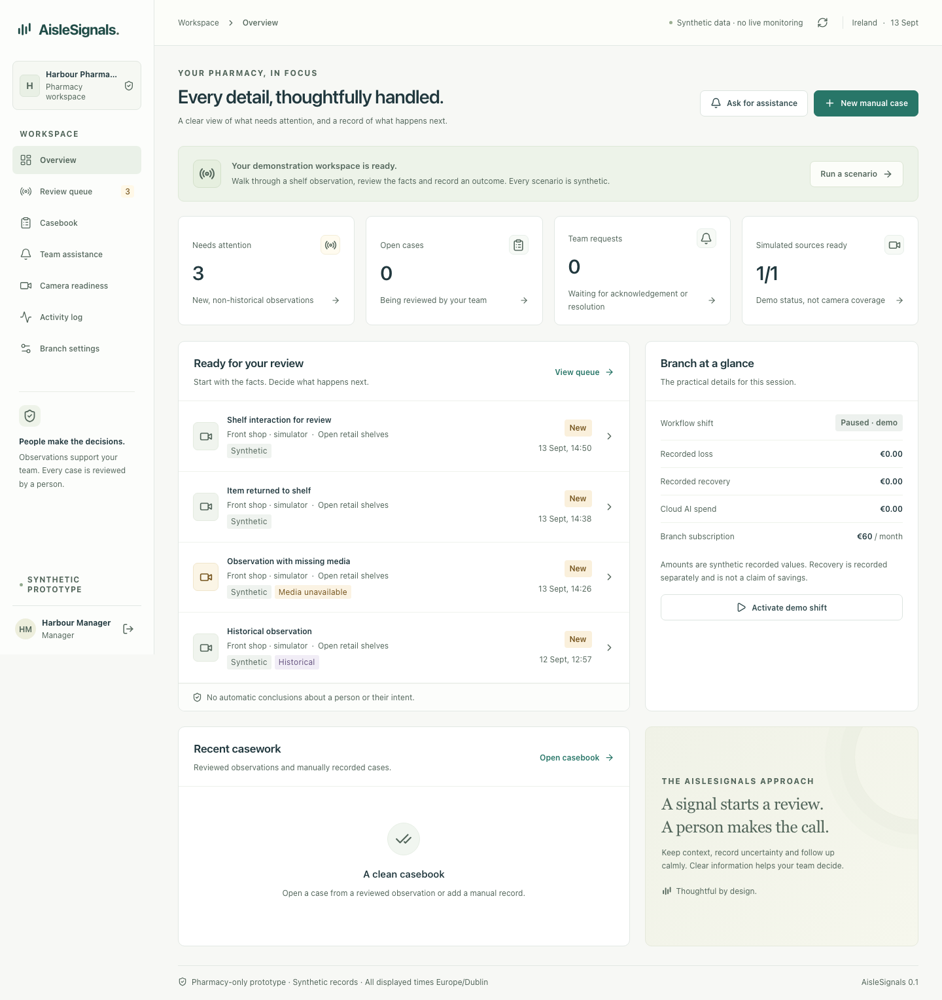

# AisleSignals

A working first prototype for pharmacy incident review, evidence context and staff assistance. Built for Jawahir Q. by Codex and specialist agents.

**€60 per pharmacy branch per month. Existing Windows or Mac laptop. No hardware purchases.**

This version runs locally with a dedicated **LIVE DETECTION** tab: explicitly selected CCTV window, browser camera or recording → local body-pose inference → experimental temporal rules → laptop attention alarm and saved event metadata. The pharmacy case workflow retains clearly labelled synthetic observations, isolated demonstration organisations and manager/reviewer permissions. This is an experimental prototype, not a validated pharmacy theft detector. [Live Detection guide](docs/prototype/live-detection.md).



**Earlier verified desktop build:** [all six GitHub jobs passed](https://github.com/g784dwcd2r-crypto/AisleSignals/actions/runs/34762107616), including Windows x64 and Mac arm64 executable startup and login. Those historical artifacts predate Live Detection; use the current source build or a newer successfully verified workflow run for this feature.

## Start the prototype

From a checkout with Python 3.12 and Node.js 24 LTS:

```sh
python3 scripts/setup_prototype.py
.venv/bin/python scripts/run_prototype.py
```

Windows:

```powershell
py -3.12 scripts\setup_prototype.py
.venv\Scripts\python.exe scripts\run_prototype.py
```

Open **http://127.0.0.1:8765**. Sign in as **manager@harbour.demo** with **AisleDemo!2026**. These are deliberately public credentials for synthetic data only. Try **reviewer@harbour.demo** for restricted permissions, or **manager@liffey.demo** for the other organisation.

**Mari Mina Pharmacy:** select its manager account on the login screen or enter **manager@marimina.demo**, with the same public demo password. It has a separate organisation/branch, an empty casebook and review queue, one explicitly labelled simulator source, and the €60 monthly branch price. Upgrading adds this profile once while preserving existing pharmacy records and credentials. No address, contact details or actual incident history have been assumed.

After initial setup, `Start-Mac.command` and `Start-Windows.cmd` launch the source installation. Separate self-contained development bundles are built by the [GitHub workflow](https://github.com/g784dwcd2r-crypto/AisleSignals/actions/workflows/prototype.yml) when all required checks pass; they contain the runtime and do not need Node/Python on the recipient laptop. Bundles are unsigned prototypes and are labelled by the actual platform/architecture. They are not commissioned pharmacy installers.

## What you can do

- Open **LIVE DETECTION**, share an authorised CCTV window or choose a camera/recording, and start real local pose inference. View person boxes/keypoints and automatic review alarms for repeated reach-to-waist patterns or configured restricted-zone presence. Save and acknowledge branch event metadata; no theft finding or video-clip capture is claimed. See the [Live Detection guide](docs/prototype/live-detection.md).
- Load an MP4/WebM in **Video test**, play it locally, scan for visual changes and jump to activity timestamps. The recording stays in the browser; this is a playback test, not AI theft detection or a live alert. See the [video test guide](docs/prototype/video-test.md).
- Start an explicit **alarm playback test** for a repeating laptop attention tone, automatic image-change categories and a saved branch test log. Mute, stop, seek and failure controls are included. A real FBI pharmacy video is linked as a YouTube reference; the reference iframe cannot be analysed. See the [alarm and reference guide](docs/prototype/attention-alarm-test.md).
- Review, acknowledge and dismiss a synthetic observation, or open exactly one case with a recorded reason.
- Create a manual case independently of the camera and shift status.
- Record classification, outcome, manager-controlled values and named follow-up tasks.
- Close a resolved case, reopen with a manager's reason, and retain its activity history.
- Generate and approve a zero-cost factual **local template**, then download a synthetic JSON case record with a SHA256 integrity digest.
- Request assistance and distinguish acknowledgement from arrival.
- Exercise missing media, historical observations, frozen/offline sources and recovery using the manager simulator.
- Inspect branch pricing, the proposed €5 AI budget, camera-readiness limitations and scoped audit activity.

Writes are transactional and versioned. Server-side checks enforce site/organisation access, roles, session expiry, CSRF, origin/host restrictions, input validation and duplicate-request protection. The browser shows errors, preserves unsaved input during a connection failure and requires explicit conflict reconciliation.

## Build and verify

```sh
.venv/bin/python -m pytest tests/api tests/companion -q
npm ci
npm run build
npm run test:web
npx playwright install chromium
AISLESIGNALS_TEST_PYTHON=.venv/bin/python npm run test:e2e
```

Run `npm ci --prefix apps/web` first if the setup script has not installed interface dependencies. On PowerShell, set `$env:AISLESIGNALS_TEST_PYTHON='.venv/Scripts/python.exe'` before the browser test command. Tests use separate temporary data; they do not reset the demonstration workspace.

[Verification results](docs/prototype/verification.md) distinguish checks actually run from production requirements still planned. [Implementation status](STATUS.md) records the release boundary.

## Repository map

| Path | Purpose |
|---|---|
| `apps/web` | React/TypeScript pharmacy interface and UI helper tests |
| `services/api` | FastAPI, local SQLite persistence, scoped sessions and workflow rules |
| `services/companion` | Explicit existing-laptop/read-only camera readiness utility |
| `tests/api`, `tests/companion`, `tests/e2e` | API, network-boundary and real-browser checks |
| `scripts`, `packaging` | Local launch, repeatable setup, executable packaging and bundle smoke checks |
| `docs/prototype` | Implemented contract, setup, threat model, scenario coverage and verification |
| `docs/handover` | Full production design: 67 requirements, planned API/data model and build roadmap |

## Scope and next release

The clarified core product is **automatic CCTV monitoring** across a browser viewer, desktop CCTV app or existing recorder. The [CCTV monitoring specification](docs/prototype/cctv-monitoring.md) defines the full target. The implemented Live Detection slice supports browser-mediated screen/device input and local files, local pose inference, observable rules and laptop alarms. Direct recorder/RTSP adapters, validated concealment classification, automatic grid tiling and evidence clips remain future work. The pharmacy review queue remains synthetic.

The prototype uses local SQLite and public demo accounts to make the workflow testable now. Production remains the documented React/FastAPI/PostgreSQL design with managed MFA, qualified camera integration, encrypted evidence lifecycle, signed Windows/Mac companion packages and actual site acceptance. The prototype's `/api` is a documented implementation slice, not completion of the full planned `/v1` contract.

Monitoring on the existing laptop will require it to remain powered on and awake. Camera/recorder interfaces must be qualified; universal compatibility is not promised. There is no automatic facial recognition, shared watchlist, person-level criminality prediction, clinical decision or door-lock control. This build makes no paid model calls or customer charges.

Read the [prototype guide](docs/prototype/README.md), [laptop readiness guide](docs/prototype/companion.md), [functional/technical plan](docs/handover/implementation-plan.md), [formatted plan PDF](docs/handover/aislesignals-implementation-plan-jawahir-q.pdf) and [commercial baseline](docs/handover/business-baseline.json).
