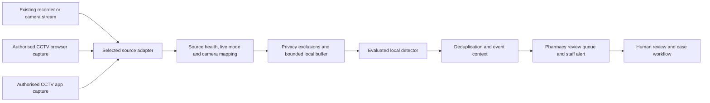

# AisleSignals — automatic CCTV monitoring

Product owner: Jawahir Q. · Direction clarified 13 September 2026.

**Status: full-target specification with an implemented experimental slice.** The dedicated [Live Detection tab](live-detection.md) now acquires explicitly selected browser screen/device video or local recordings, runs real local pose inference, applies temporal review rules and connects laptop sound to saved metadata events. Direct recorder/RTSP adapters, validated pharmacy interaction classes, grid tiling and event clips below remain planned. The camera-readiness command still requests metadata only.

Subsequent implemented slice: the [local video-file test](video-test.md) loads MP4/WebM recordings and scans for visual activity entirely in the browser. It is deliberately separate from live-source ingestion and trained AI; its results do not create incidents or live alerts.

An explicit [alarm playback test](attention-alarm-test.md) now replays a completed scan with bounded laptop attention tones, automatic image-change categories and persistent branch test events. This does not implement suspicious-interaction recognition or a live CCTV alarm. A linked real pharmacy YouTube reference is viewable separately and is not analysed.

## Product behaviour

After an authorised setup, the software on the pharmacy's existing Windows or Mac laptop should acquire supported CCTV video, analyse qualified camera views automatically, create reviewable observations, attach the permitted event context and notify staff. Staff should not need to create each observation, press a simulator button or watch all cameras continuously. Staff determine what actually happened; an automated observation does not establish theft.

The existing CCTV system remains the recording system. AisleSignals adds selective analysis, event context and the incident workflow. The first live implementation must demonstrate input → automatic analysis → observation → staff alert → existing review workflow with a real supported source. A preview of video alone is not completion.

The user requires consideration of a browser viewer, a desktop CCTV app and a separate monitor. This addendum supersedes the categorical exclusion of viewer screen capture in `docs/handover/existing-laptop-design.md`, item 4. Authorised selected-window capture is now an intended fallback, subject to explicit qualification. The rest of baseline 2.2, including no hardware purchases, scope isolation and output controls, remains in force. Historical handover files and their checksums are preserved.

## Three supported setup paths

| Staff's existing setup | Preferred connection | Alternative and limit |
|---|---|---|
| CCTV grid in a laptop browser | Existing recorder/camera stream or documented vendor interface available to an authorised local adapter | User selects the CCTV tab/window for capture. Analyse configured camera tiles only. Browser capture requires an explicit user gesture and fresh capture permission for each session; it cannot silently restart after a browser restart. |
| CCTV grid in a laptop desktop app | Existing recorder stream or the vendor's documented local interface | Native selected-window capture, with OS permission. Qualify the exact app, OS, rendering mode and minimise/lock behaviour. Blocked, black or unavailable captures remain unsupported; never bypass capture protection. |
| CCTV on a separate physical monitor | Connect the existing recorder to the laptop through an already available, authorised network/software path, then use the same pipeline | The monitor's visible picture does not itself provide laptop-readable video. If a usable feed or existing capture capability is absent, live analysis is unsupported under the no-new-hardware constraint. A CCTV monitor's HDMI output is not automatically a laptop input. |

Separate monitors are a discovery path, not a fictional fourth software capture API. A monitor showing an app rendered by the same laptop can be handled through that app/window. A standalone recorder/TV requires access to the recorder's video. Do not point the laptop webcam at a monitor or propose new capture cards as a workaround.

Direct streams are preferred because they preserve distinct camera channels and avoid dependence on viewer window layouts. Standards and tools offer potential integration routes, not universal support: [ONVIF Profile T](https://www.onvif.org/profiles/profile-t/) describes video streaming and supported event capabilities, and [FFmpeg's RTSP documentation](https://ffmpeg.org/ffmpeg-protocols.html#rtsp) describes stream reception. Validate vendor access rights, codec, credentials, stream limits and image suitability per site.

## Installation and connection flow

1. Select the pharmacy branch and the existing laptop. Show the confirmed €60/month branch price without creating a charge.
2. Ask where CCTV is viewed: browser, desktop app or separate monitor. Record the actual software/recorder when known; absence of a model must not be treated as universal compatibility.
3. Offer the supported direct connection first. The alternative is an explicitly selected CCTV tab/window, or instructions to obtain an existing recorder feed for a separate monitor. Do not scan the network or enable the built-in webcam automatically.
4. Keep credentials in the platform's protected store. Obtain only necessary OS capture permission, with audio disabled. Bind the source configuration to this organisation and branch.
5. Preview the selected input and verify that it is CCTV. Define camera names, tile rectangles, privacy exclusions and the current viewer layout version. Exclude consultation views and pharmacy/prescription software before buffering or inference. A whole-desktop selection is rejected in the initial screen-capture implementation because unrelated applications can appear in it.
6. Establish live/playback mode and source-time confidence. Validate source and decode health separately. A new screenshot arrival alone proves only that a screen was captured now.
7. Benchmark the selected views with normal pharmacy software running. Start with one or two qualified views, then increase only if the laptop, image detail and detector evaluation support it. Display selected/qualified views, not the total number visible on a CCTV mosaic as a coverage claim.
8. Enable an evaluated detector and its accepted classes, privacy policy, trading hours, resource limits and approved local staff notification route. The setup is incomplete if video is visible but no detector is running.
9. Run a supervised acceptance example and an outage/recovery example. Show the automatic observation in the existing review queue and verify the actual alert. Save the qualified source configuration and provide a visible pause/stop control.

Do not promise fully unattended reconnection for every input. Direct feeds may reconnect under their valid configuration and authority. Browser screen sharing requires a new user selection after the capture session ends: this is a browser requirement, not a setting AisleSignals can bypass. [MDN screen-capture permission behaviour](https://developer.mozilla.org/en-US/docs/Web/API/MediaDevices/getDisplayMedia#security).

## Shared local pipeline

Windows and Mac share the source, event and health contracts. Native window capture has platform-specific adapters: investigate [Windows.Graphics.Capture](https://learn.microsoft.com/en-us/windows/apps/develop/media-authoring-processing/screen-capture) and [Apple ScreenCaptureKit](https://developer.apple.com/documentation/screencapturekit), with exact OS and packaging qualification. Windows provides user selection of a window/display and a runtime support check; the same implementation must not be assumed to cover Mac. OS capture APIs are separate work from the existing Python metadata probe.

Planned boundaries:

- **Source adapter:** capabilities, open/close, bounded frame delivery and health. Types `RECORDER_STREAM`, `BROWSER_CAPTURE`, `WINDOW_CAPTURE`, `RECORDED_CLIP`; simulator remains a distinct test type. A source never gets arbitrary tenant scope from a request body.
- **Frame envelope:** organisation/site/source/camera IDs, capture session and sequence, monotonic arrival, source timestamp when available, time confidence, live/playback/unknown mode, dimensions, mapping/policy version and provenance. Frame bytes stay local until the separately authorised media route accepts them. Never log frames, window titles, credentials or raw source URLs.
- **Camera mapping:** each mosaic tile is a separate logical view. Crop before analysis; mask unrelated pixels before recording. Viewer resize, camera reordering, rotation, zoom/fullscreen or a material layout change invalidates the mapping until revalidated. Enlarging a low-resolution tile cannot restore missing detail.
- **Detector adapter:** explicit model/version/licence, supported event classes, minimum accepted input rate and resolution, resource budget and measured quality. Temporary within-scene tracks may aid motion continuity; there is no persistent person identity or returning-person recognition in this release.
- **Observation intake:** a dedicated authenticated device/source path, with scoped event IDs, persistent deduplication and bounded event metadata. Do not send real events through `/api/simulator` or label screen-captured footage as original recorder evidence. Review derivatives preserve their provenance.
- **Staff notification:** private visual notification and an optional bounded laptop chime after commissioning. Health failures use a distinct message. Physical alarms remain a separate commissioned vendor integration; no model output directly actuates them.

Camera health, browser sessions and device authority remain distinct. A scoped local worker may continue under its valid configuration when the dashboard is closed; this requires the production device/lease model, not the current public demo cookie. Stopping a selected screen-capture session must stop its collection immediately. The existing fifteen-minute capture-lease and outage rules remain the baseline; this addendum does not promise unlimited offline capture.

## Health and live-event rules

Represent capture availability, viewer mode, source freshness, mapping validity, detector status and notification availability separately. Display **Monitoring active** only for views with all required checks passing. Include the last analysis time and any coverage gap. An operator selecting "live" during setup is not permanent proof: if the viewer exposes no reliable ongoing live-mode or timestamp signal, sustained verified-live operation cannot be claimed. Camera movement or PTZ changes also require revalidation of the affected zones.

| Condition | Required behaviour |
|---|---|
| User plays an old recording or changes playback speed | Route to retrospective review; suppress current-incident notification and physical output. Source event time stays distinct from ingestion time. |
| Screen frames arrive but live provenance is unknown | Mark freshness unknown; permit clearly labelled review observations only. Do not represent them as verified live events. |
| Stream timestamp advances but video is frozen | Mark the view suspect/unavailable using decoder and content checks. An advancing on-screen clock or mouse cursor alone cannot certify camera freshness. |
| Normal scene is still | Do not declare an outage from identical pixels alone; combine timing, decoder health and source-specific checks. |
| Viewer closes, logs out, loses permission or returns black/protected content | Stop analysing the affected source, show the reason and record the gap. Resume only after source/mapping/freshness checks pass. |
| Window minimises, becomes occluded, moves display or changes scaling | Check actual platform behaviour. If coverage cannot be established, mark unavailable; do not assume every OS/app combination keeps rendering. |
| Mosaic layout changes or a tile is obscured | Invalidate the affected mapping and pause that view; never silently attribute the wrong camera to an event. |
| Laptop sleeps, shuts down or runs out of power | Monitoring stops. On resume recheck permission, clocks, source, mapping, lease and detector before returning to active. Do not silently change power policies. |
| CPU, memory, disk or thermal limits are reached | Report degraded coverage and reduce only within the evaluated operating range; otherwise disable affected classes. No silent switch to paid cloud video processing. |
| Network or backend fails | Follow the bounded local lease/buffer policy, preserve event IDs, retry with backoff and report missing media. Reconnected old events remain historical. |
| Same event spans multiple frames, sources or a reconnect | Deduplicate retries by source/session/sequence/event ID. Any cross-camera association requires separate evaluation and must not create identity claims. |
| Detector stops while preview still works | Show **Video available · analysis unavailable**. A moving preview must not keep monitoring status green. |
| Event clip is incomplete or missing | Keep the metadata observation with an explicit limitation; never manufacture context or silently call the event verified. |

## Economical AI strategy

The €60 monthly branch price does not fund unrestricted cloud video inference. The intended route is local frame handling, inexpensive activity filtering and an evaluated lightweight local vision model, followed by event deduplication. Optional paid AI receives only selected, permitted event material or reviewed facts under a hard per-branch budget. A thresholded pixel-motion filter is not a theft detector and must never be sold as one.

Keep the proposed €5/month paid-AI cap as a planning ceiling. It is not validated capacity or a promise that a chosen supplier fits it. Measure model licence fees, decode/inference workload, eligible events, media size and support effort before enabling an offer. No always-on paid model calls are introduced by this specification.

Start evaluation with observable classes: person presence in a configured zone, an agreed line crossing, and source health. Shelf interactions, concealment and aggression require separately suitable data/models and event-level evaluation. Neither clothing, appearance nor a dwell score establishes criminal intent. Report event precision, missed events, false alerts per trading hour and time-to-alert on held-out site-representative footage; do not present frame-level model accuracy as theft prevention performance.

## Build order and acceptance

1. Implement typed source/health/observation contracts and a local supervisor with deterministic recorded fixtures. Cover live/playback/unknown, reconnect, bounded queues and lost authority before activating real sources.
2. Implement protected recorder-stream connection and one supported decode route. Keep browser/app capture behind the same contract; all three setup paths must be visible, including explicit unsupported separate-monitor outcomes.
3. Implement browser selected-tab/window capture for an attended prototype, then native Windows/Mac window adapters where qualified. Do not equate a browser capture demo with unattended production support.
4. Implement tile mapping/privacy masks and an evaluated local detector with the required frame rate. Wire automatic observations, media provenance, duplicate handling and local notifications into the existing pharmacy workflow.
5. Qualify both actual pharmacy laptops: live source, prerecorded playback, one unavailable tile, mapping change, permission revocation, viewer restart, sleep/resume, network loss, disk/resource pressure and detector failure. Test recordings use authorised data; no pharmacy data is committed to Git.
6. Before live use, replace public demo identity, implement protected evidence storage/retention and production device authority, sign the platform packages and complete site acceptance. Standalone prototype bundles already building successfully do not satisfy these gates.

Completion requires an authorised source to produce a correct automatic observation without the simulator, maintain honest per-view status, preserve scope/provenance and notify staff as configured on both accepted OS installations. Unsupported sources must produce a clear connection limitation. This work extends FR-013 coverage health, FR-015 normalised observations, FR-016 idempotent intake, FR-059 offline/degradation and FR-067 existing-laptop requirements; it does not mark them complete. A separate read-only agent reviewed the three input routes, baseline conflict, freshness rules and failure acceptance; its findings are incorporated here. No camera or screen was captured during this specification work.
