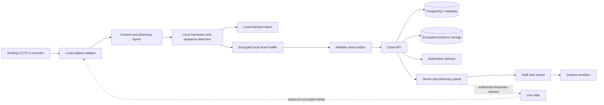

# AisleSignals master production plan

Prepared for: Jawahir Q.

Product: AisleSignals for pharmacies

Commercial baseline: EUR 60 monthly for each activated pharmacy branch

Hardware baseline: existing pharmacy CCTV and existing Windows or Mac laptop

Status: consolidated approved plan; implementation and branch acceptance remain incomplete

## 1. Outcome

AisleSignals will be a pharmacy security assistance product that connects to supported existing CCTV, analyses authorised video locally, raises a loud local attention alarm for qualifying observable interactions, sends a private alert to the cloud, presents encrypted snapshots and an optional incident clip, and lets authorised staff dismiss the alert or create and manage an incident.

The same product will give a company owner one role-scoped operations portal across all of their pharmacy branches. It will show laptops, cameras, detector health, alerts, incidents and staff responses. It may provide temporary, audited live viewing for authorised troubleshooting or an active event. Continuous cloud CCTV streaming is disabled by default.

The system supports human decision-making. It does not identify a person as a thief, infer criminal intent from body language, recognise people across visits, create a shared watchlist or make an autonomous legal finding.

This master plan consolidates:

- **Plan U:** complete pharmacy desktop application and CCTV-to-cloud workflow.
- **Plan B:** central multi-pharmacy administration, evidence and operations.
- **Plan X:** spatial pharmacy intelligence and stronger sequence-based detection.
- **Plan Z:** customer registration, subscription and commercial onboarding.
- The remaining notification, compliance, security, support, recovery and release work.

## 2. Product rules

1. One paid subscription covers one activated pharmacy branch at EUR 60 monthly.
2. No required camera, appliance, GPU, capture card, relay or other new hardware is introduced.
3. Unsupported CCTV equipment is reported as unsupported; compatibility is never assumed.
4. Detection happens on the existing pharmacy laptop where capacity permits.
5. A laptop heartbeat, camera health, detector health and alarm readiness are independent states.
6. Failed or stale inputs fail closed and remove active-coverage claims.
7. Alerts describe observable activity and always require staff review.
8. Evidence follows branch authority, encryption, retention and audit controls.
9. Every production-enabled branch and camera requires its own acceptance record.
10. A successful build, cloud deployment or demo does not establish detection accuracy or physical-site readiness.

## 3. Current baseline

| Capability | Current position | Production gap |
|---|---|---|
| Cloud hosting | Render-hosted control service with PostgreSQL staging foundation | Verify final production separation, backups, restore, rollback, monitoring and production domain |
| Identity | Owner login, authenticator enrollment and role-aware cloud foundation | Complete self-service account lifecycle, email delivery, invitations, resets, recovery and session management |
| Organisations and pharmacies | Pharmacy creation, users and branch-scoped foundation | Complete commercial organisation hierarchy, owner transfer, branch permissions and offboarding |
| Laptops | One-use registration and heartbeat companion | Unite the companion with the detector application and report camera, detector, alarm and queue health |
| Desktop product | Local prototype and development packaging exist | Produce signed, lifecycle-managed Windows and macOS installers and automatic updates |
| CCTV inputs | Browser/window/file capture and experimental layout work exist | Qualify actual RTSP, ONVIF and CCTV-viewer routes on each pharmacy system |
| Four/six-camera layouts | Proposed local grid detection and manual confirmation exist | Map every tile to a physical camera and process accepted feeds with independent freshness |
| Detection | Pose and local sampled-frame interaction analysis are experimental | Build sequence tracking and measure false alerts, misses, abstention and latency on pharmacy data |
| Alarm | Local attention tone, arming and acknowledgement concepts exist | Commission audibility, minimized operation, cooldown and recovery on each laptop |
| Cloud alerts and incidents | API and dashboard workflow foundation exist | Connect actual local detection, evidence and review outcomes end to end |
| Snapshots and clips | Agreed in Plan B | Implement encrypted overview/crop snapshots, optional clips, retention, deletion and audit |
| Central live view | Designed as temporary and audited | Implement secure session negotiation and media relay after privacy and bandwidth approval |
| Billing | EUR 60-per-branch model is recorded | Implement verified signup, checkout, invoicing, VAT handling, failed payments and cancellation |
| Compliance | Controls and document requirements are identified | Complete branch-specific records and obtain Irish privacy review before evidence mode |
| Rollout | Six-pharmacy target and coordinator tooling exist | Inventory, install, calibrate, train and accept each real branch |

## 4. Target architecture

### 4.1 Pharmacy laptop

The installed application contains:

- A desktop shell and local operator interface.
- Secure one-use pairing and protected device credentials.
- CCTV adapters for qualified RTSP/ONVIF, browser CCTV and native-viewer capture.
- Four/six-camera grid proposal, confirmation and tile mapping.
- Per-camera zones, privacy masks and calibration versions.
- Person, hand, shelf and product-interaction tracking.
- Temporal sequence engine and confidence/abstention rules.
- Pre-event frame buffer and post-event evidence capture.
- Commissioned laptop alarm, acknowledgement, mute and cooldown.
- Encrypted local queue for offline cloud delivery.
- Independent health reporting for application, source, camera, detector, alarm, disk and queue.
- Signed updates, startup setting, single-instance ownership, sleep/resume recovery and rollback.

### 4.2 Cloud control plane

The cloud service contains:

- Organisations, subscriptions, pharmacies, users, memberships and permissions.
- Registered laptops, cameras, layouts, health and configuration versions.
- Alerts, snapshots, clips, reviews, incidents, tasks and audit history.
- Notification routing and delivery attempts.
- Short-lived live-view sessions and bounded remote commands.
- Retention, deletion, export, legal hold and data-subject request controls.
- Operational metrics, backups, restore, deployment health and rollback records.

### 4.3 Trust boundaries

- Camera credentials remain in the local operating-system credential store.
- The cloud accepts data only from a registered device credential bound to one organisation and branch.
- Browser-supplied organisation, branch, user or media identifiers never create authority.
- Media requires a fresh authenticated request, role and branch permission; URLs are short-lived and revocable.
- Remote commands are signed, expiring, idempotent and limited to AisleSignals-owned functions.
- Secrets, tokens, passwords, footage and customer narratives never enter source control or ordinary logs.

## 5. End-to-end operating journeys

### 5.1 Branch onboarding

1. A company owner creates or accepts their organisation account.
2. The owner creates a pharmacy branch and selects its subscription.
3. The manager records operating contacts, privacy mode, retention and reviewer assignments.
4. The installer records the laptop, operating system, CCTV model, camera count and authorised connection route.
5. A one-use code pairs the installed desktop application to the branch.
6. The application discovers or captures sources and proposes the four/six-camera layout.
7. A manager confirms camera names, tile mapping, entrances, exits, cashier, shelves, staff areas and privacy masks.
8. Camera, detector and alarm tests run separately.
9. Silent evaluation measures normal activity and staged interactions.
10. Only accepted cameras and event classes are armed.

### 5.2 Detection and alert

1. A camera supplies fresh frames to the local detector.
2. The detector tracks observable interactions over time: take, return, basket placement, prolonged handling, possible concealment and exit with an unresolved item.
3. The sequence engine combines product, hand, person and zone continuity and may return `UNCLEAR`.
4. A fresh qualifying result passes threshold, cooldown and duplicate checks.
5. The commissioned laptop alarm sounds and displays the camera and observable reason.
6. The local application creates one event and queues cloud delivery.
7. Privacy-first mode sends metadata only. Evidence mode sends an encrypted overview snapshot, interaction crop and optional bounded clip.
8. The cloud creates one alert and routes private notifications to available reviewers.

### 5.3 Alert review and incident creation

1. Staff acknowledge the alert locally or in the portal.
2. An authorised reviewer examines the snapshots and clip when evidence mode is enabled.
3. The reviewer records `BENIGN`, `UNCLEAR`, `SUSPECTED_INCIDENT` or another approved factual outcome with a reason.
4. Benign evidence follows the short retention rule and does not create an incident.
5. An unclear alert remains assigned for follow-up or expires according to policy.
6. A reviewed concern can create an incident containing selected evidence, staff notes, tasks and outcomes.
7. A manager can correct, close or reopen the incident without erasing prior history.

### 5.4 Central operations

1. A platform owner sees service health across customers but receives customer media access only through an appropriate audited grant.
2. A company administrator sees every permitted pharmacy in their company.
3. A pharmacy manager sees assigned branches; reviewers see assigned alerts and incidents.
4. The dashboard separates offline laptop, lost source, frozen camera, stopped detector, uncommissioned alarm and delayed queue states.
5. A confirmed four/six-camera wall shows only fresh, correctly mapped sources.
6. Temporary live view requires permitted purpose, selected cameras, short expiry and an audit record.
7. Remote diagnostics can refresh health, reconnect a source, restart an owned process or run an attended alarm test.

### 5.5 User and account administration

- Owners invite, assign, suspend and remove team members within their company.
- Owners and authorised managers assign explicit roles and pharmacy branches.
- Removal revokes sessions, invitations, notifications and live grants immediately while preserving historical attribution.
- The final owner must transfer ownership before being removed or demoted.
- Users edit approved profile fields, change password, verify email changes, manage MFA/recovery codes and revoke active sessions.
- Owners may send expiring password-reset links to team members but can never view or set their passwords.
- Password, email, MFA and permission changes require recent authentication and create security notifications and audit events.

### 5.6 Customer subscription

1. A prospective customer creates and verifies an account.
2. They create a company and first pharmacy or accept an invitation.
3. The service presents the EUR 60 monthly price for each activated branch, tax and renewal terms.
4. Hosted checkout creates a subscription; payment details do not pass through AisleSignals servers.
5. A successful provider webhook activates the purchased branch entitlement idempotently.
6. Failed payments enter a documented grace period without silently deleting evidence or accounts.
7. Cancellation stops future renewal and follows the offboarding/export/deletion procedure.

## 6. Master workstreams

### M0 — Governance, inventory and decisions

**Build**

- Record all six branches, legal company ownership, managers and reviewers.
- Inventory laptop OS/version/architecture, CPU/RAM/disk, speaker and sleep policy.
- Inventory CCTV/recorder vendor, model, firmware, codecs, camera count and available interfaces.
- Record internet upload bandwidth, firewall restrictions and local IT contact.
- Select the first Harbour Pharmacy laptop and one camera as the reference route.
- Create a decision register for retention, evidence mode, clip duration, live-view policy and escalation.

**Exit evidence**

- No production-enabled branch has an unknown laptop, camera source, reviewer or privacy mode.
- Unsupported equipment and missing permissions have explicit reasons and owners.

### M1 — Cloud foundation, identity and tenant isolation

**Build**

- Separate staging and production services, databases, secrets, domains and access.
- Complete organisation, pharmacy, membership, role and permission models.
- Add invitations, verified email changes, password change/reset, MFA recovery and session/device management.
- Implement immediate revocation, owner transfer and final-owner protection.
- Apply organisation and pharmacy scope to APIs, media, jobs, exports, notifications, live sessions and commands.
- Add rate limits, CSRF/origin controls, audit events and support grants.

**Exit evidence**

- Cross-organisation and unassigned-branch requests fail through browser, API, media and background paths.
- Password-reset enumeration, replay, expiry and rate-limit tests pass.
- Permission reductions terminate affected sessions and media access immediately.

### M2 — Complete Windows and macOS desktop application

**Build**

- Combine the interface, capture adapters, detector, alarm, evidence buffer and cloud sender into one application.
- Produce a Windows installer and macOS package that require no development checkout or separate runtime.
- Add startup-on-login, single-instance operation, auto-update, staged rollout and rollback.
- Protect device and camera credentials using the operating-system store.
- Handle offline operation, sleep/resume, low disk, update failure and clean uninstall.
- Obtain Apple signing/notarisation and Windows code-signing credentials.

**Exit evidence**

- Clean supported Windows and Mac laptops install, pair, launch, restart, update, roll back and uninstall.
- Signatures verify and invalid or tampered packages fail.
- Offline queues survive restart without duplicate delivery.

### M3 — CCTV connectivity and layout calibration

**Build**

- Implement read-only RTSP with ONVIF discovery where existing equipment supports it.
- Retain explicit browser/window/native-viewer capture as a qualified fallback.
- Diagnose authentication, codec, frozen frames, window loss and reconnection.
- Detect candidate 2x2, 3x2 and 2x3 mosaics and require operator confirmation.
- Map every tile to a stable camera identity and independent freshness state.
- Calibrate usable area, shelves, cashier, entrances, exits, staff/restricted areas and privacy masks.
- Invalidate detection after a source, layout or calibration change until requalification.

**Exit evidence**

- Actual four-camera and six-camera examples retain correct identity through restart and reconnect.
- Frozen or displaced tiles never display active coverage.
- Each production-enabled camera has a manager-approved calibration version.

### M4 — Baseline interaction detection

**Build**

- Detect people, pose, hands, shelf regions and product interactions using efficient local inference.
- Maintain short-lived anonymous tracks within one camera session.
- Classify take, return, basket placement, prolonged handling, possible concealment and insufficient evidence.
- Combine multiple chronological observations rather than treating one pose as proof.
- Add per-camera thresholds, cooldown, duplicate suppression and explicit abstention.
- Preserve model, rule, threshold, layout and camera versions on every result.

**Exit evidence**

- Unit and sequence tests cover ordinary shopping, staff stocking, occlusion, crowds, returns, baskets and source interruption.
- The detector never outputs a person identity, criminality score or automatic theft verdict.
- Performance stays within agreed CPU, memory and thermal limits on both pilot laptop classes.

### M5 — Plan X spatial intelligence

**Build**

- Generate a 2.5D branch map from confirmed camera zones and floor relationships; use a full 3D representation only when measurements show additional value.
- Represent shelves, product areas, cashier, entrance, exit and occlusion boundaries.
- Link camera-local events into branch-level product-state sequences without biometric identity.
- Track unresolved product state through take, carry, return, basket, cashier and exit zones.
- Use path feasibility, duration and zone transitions as evidence features.
- Add confidence calibration and `UNCLEAR` when continuity is insufficient.

**Exit evidence**

- Held-out comparison demonstrates that the spatial layer improves agreed detection metrics or reduces alert burden over the baseline.
- A camera or layout change invalidates the affected spatial model.
- No cross-visit or cross-pharmacy person tracking is introduced.

### M6 — Local alarm and notification escalation

**Build**

- Add loud bounded alarm patterns, visual indication, acknowledgement, mute and cooldown.
- Test alarm behavior while minimized and after audio-device change or sleep.
- Route cloud notifications by branch, role, shift and escalation order.
- Support email first; add SMS or browser push only with selected providers and measured costs.
- Retry transient failures and prevent duplicate notifications.
- Escalate only when an alert remains unacknowledged for the configured interval.

**Exit evidence**

- A person at each branch records speaker audibility and staff response.
- Notification delivery, failure, retry, escalation, acknowledgement and quiet-policy tests pass.
- Historical buffered alerts never trigger a current local alarm.

### M7 — Cloud alert, snapshot and incident evidence

**Build**

- Implement privacy-first metadata alerts and controller-approved evidence mode.
- Capture one overview image, one interaction crop and an optional short pre/post-event clip.
- Encrypt evidence locally and in transit; validate type, size, checksum and event binding.
- Quarantine incomplete media and expose explicit readiness/failure states.
- Implement branch-scoped viewing, range playback, download, export, deletion, expiry and legal hold.
- Connect review outcomes to incident creation without duplicating alerts or cases.

**Exit evidence**

- Detection → alarm → alert → snapshots/clip → acknowledgement → benign dismissal or incident passes.
- Offline retry and concurrent duplicate delivery create one alert and one evidence set.
- Wrong-tenant, expired, deleted and revoked evidence access fails.

### M8 — Central dashboard, camera wall and temporary live view

**Build**

- Build portfolio, company and pharmacy views with filters and fault prioritisation.
- Display application, source, camera, detector, alarm and delivery health independently.
- Add freshness-aware four/six-camera branch walls.
- Add temporary live sessions over an outbound laptop connection with role, purpose, camera, expiry, concurrency and bandwidth controls.
- Add signed remote health refresh, reconnect, owned-process restart and attended alarm-test commands.

**Exit evidence**

- Stale previews are clearly labelled and removed from live status.
- Live sessions cannot cross company/branch scope and terminate at expiry or revocation.
- Expired, replayed, duplicate and out-of-scope remote commands fail and remain auditable.

### M9 — Compliance, privacy and evidence governance

**Build**

- Prepare a data-processing agreement identifying each pharmacy company as controller and AisleSignals as processor under documented instructions.
- Prepare a legitimate-interest assessment, DPIA template, CCTV/privacy notice, signage text and staff policy.
- Define dismissed-alert, incident, legal-hold, backup and audit retention.
- Implement access, correction, export, restriction and deletion request procedures.
- Define Garda disclosure authorisation and evidence-integrity handling.
- Exclude consultation rooms, prescription screens, keypads, audio and unnecessary views.
- Obtain review from a qualified Irish privacy professional before evidence-mode production use.

**Exit evidence**

- Each branch records controller approval, privacy mode, policy versions, reviewers and retention before activation.
- Evidence mode cannot activate while required compliance or security settings are missing.
- A simulated access/deletion request and authorised evidence export pass.

### M10 — Security, resilience and operations

**Build**

- Run dependency, secret, container, configuration and static security scans.
- Commission independent penetration testing before broad production release.
- Rotate encryption and signing keys with versioned recovery procedures.
- Add database backups, encrypted media backup policy, restore drills and recovery objectives.
- Add readiness/liveness checks, central logs, metrics, alerting and deployment provenance.
- Define incident response, breach response, rollback, status communication and maintenance procedures.
- Establish service availability and support-response targets that match actual staffing.

**Exit evidence**

- Backup restore and application rollback are measured, documented and repeatable.
- No unresolved critical security issue remains.
- Production health, failure and recovery notifications reach the named operator.

### M11 — Plan Z commercial onboarding and billing

**Build**

- Create public product, pricing, sign-up, verification, login and account-recovery pages.
- Add organisation creation, company invitations and first-branch setup.
- Integrate hosted payment checkout and signed webhooks.
- Charge EUR 60 monthly for each activated branch and store entitlement separately from branch existence.
- Add trial policy if approved, VAT/tax configuration, invoices, payment history, failed-payment grace, cancellation and reactivation.
- Add terms of service, privacy documents, processor terms and support boundaries.
- Track real per-branch hosting, media, notification and support cost.

**Exit evidence**

- Signup → verification → checkout → branch entitlement → invoice passes in the provider sandbox.
- Duplicate or forged webhooks cannot duplicate or activate a subscription.
- Cancellation and failed payment follow the documented access and evidence rules.
- The EUR 60 offer has a measured sustainable cost envelope.

### M12 — Pharmacy onboarding, training and support

**Build**

- Create branch inventory forms, installer checklist and camera troubleshooting guide.
- Build guided pairing, source connection, grid confirmation and layout calibration.
- Create manager, reviewer and owner training.
- Run alarm drills and explain alert versus incident decisions.
- Define support intake, diagnostic bundle, escalation and customer communications.
- Prepare offboarding, evidence export and secure credential removal.

**Exit evidence**

- A new supported branch completes installation and acceptance using the documented workflow.
- Named staff demonstrate alarm acknowledgement, benign dismissal, incident creation and recovery.

### M13 — Evaluation, release and six-branch rollout

**Build**

- Create an authorised labelled evaluation set containing normal trading and staged events.
- Freeze branch/camera/day-separated training, tuning and held-out partitions.
- Report precision, recall, missed-event rate, false alerts per normal camera-hour, abstention, latency and review burden.
- Define go/no-go thresholds per enabled class before examining held-out results.
- Run Windows, macOS, four/six-camera, offline, outage, duplicate, media and notification tests.
- Roll out one reference branch, then one Mac and one Windows branch, then the remaining accepted branches.
- Maintain release notes, deployment provenance, rollback instructions and branch acceptance records.

**Exit evidence**

- The reference branch passes the complete real workflow and supervised observation period.
- Every enabled camera/class has a versioned evaluation and manager acceptance.
- Required automated checks, privacy/security records, training and recovery drills pass before production promotion.

## 7. Detection evaluation standard

Detection quality is reported per branch, camera, event class, model, threshold and layout version. Aggregate percentages cannot hide a failing camera or class.

Required measures:

- Precision and recall for each supported observable interaction.
- Missed staged events and their conditions.
- False alerts per normal camera-hour.
- `UNCLEAR` or abstention rate.
- Event-to-local-alarm and event-to-cloud-alert latency.
- Duplicate-alert rate.
- Reviewer disagreement and time to acknowledgement.
- CPU, memory, disk, thermal and dropped-frame behavior.
- Performance during occlusion, crowds, staff activity and source degradation.

Initial numeric acceptance limits must be agreed from the first measured baseline. They are not invented in advance. Automatic audible alarms remain in attended evaluation until the pharmacy manager accepts the measured alert burden and miss rate.

## 8. Data and retention model

### 8.1 Core records

- Organisation and subscription.
- Pharmacy branch and configuration versions.
- User, membership, role and branch permission.
- Laptop device, credential, application version and health components.
- CCTV source, camera tile, zone map and privacy masks.
- Detection observation and anonymous within-session track.
- Alert, notification attempts and acknowledgement.
- Evidence object, checksum, encryption key version, retention state and access history.
- Review, incident, task, outcome, correction and closure.
- Live session, support grant and remote command.
- Audit event, deployment, backup and commissioning record.

### 8.2 Retention classes

- Normal continuous CCTV remains in the existing pharmacy system under its policy.
- Privacy-first cloud alerts contain no images or clips.
- Dismissed alert evidence uses the shortest controller-approved operational period.
- Incident evidence uses a separately justified case period.
- Legal hold suspends deletion only for selected evidence with authority and reason.
- Expired items are deleted from active storage and age out of backups under the documented schedule.
- Audit and billing records follow their own documented legal and operational requirements.

## 9. Production infrastructure

### Environments

- **Development:** synthetic data and local services.
- **Staging:** isolated Render service/database, synthetic or explicitly authorised test data, provider sandbox integrations.
- **Production:** separate service/database/storage/secrets/domain, real customer data and restricted operator access.

### Required controls

- Declarative migrations with forward and rollback procedures.
- Health endpoints that distinguish process, database, schema, media, worker and notification readiness.
- Automated database backups and scheduled restore tests.
- Encrypted object storage for evidence; PostgreSQL stores metadata rather than large video bodies.
- Secret rotation and least-privilege service identities.
- Deployment by immutable revision with staged health checks and last-known-good rollback.
- Cost and storage alarms to protect the per-branch commercial model.

One web service and one PostgreSQL database can support the initial control plane if background work remains bounded and measured. Evidence storage, media relay and heavier workers become separate services when load, isolation or recovery evidence requires them; they should not be added merely for architectural appearance.

## 10. Release gates

| Gate | Required result | Release blocked when |
|---|---|---|
| G0 Scope and inventory | Named branches, devices, sources, reviewers, policies and owners | Any production branch has unknown critical inventory or authority |
| G1 Cloud and identity | Production isolation, tenant tests, account lifecycle, backup and rollback | Cross-tenant access, recovery or production separation is unresolved |
| G2 Desktop delivery | Signed Mac/Windows install, pairing, update, offline recovery and uninstall | Either required operating system lacks an accepted package |
| G3 CCTV and layout | Real source connection, freshness, camera mapping, zones and masks | Source/layout is stale, ambiguous, unsupported or unaccepted |
| G4 Detection | Held-out results and resource use accepted per camera/class | Miss rate, alert burden or performance lacks measurement or acceptance |
| G5 Alarm and alert | Physical alarm, notification and evidence journeys pass | Alarm is inaudible, stale events actuate, or evidence delivery is unreliable |
| G6 Security and privacy | DPIA decision, agreements, access, retention and security review complete | Evidence mode lacks controller approval or a critical security issue remains |
| G7 Operations | Monitoring, support, restore, incident response and rollback proven | No named responder or tested recovery path exists |
| G8 Commercial | Subscription, invoices, terms and cost envelope verified | Entitlement or customer obligations are ambiguous |
| G9 Branch acceptance | Manager training, staged journey and signed record complete | A branch or camera relies on another branch's acceptance |

## 11. Execution order

### Phase 1 — Reference route

Complete M0 for Harbour Pharmacy, then M1, M2 and one supported M3 camera route. Deliver metadata-only M7 alerts before adding cloud media. The phase ends with one real camera feeding one installed application, a commissioned local alarm and one reviewed cloud alert.

### Phase 2 — Evidence and central operations

Complete M7 snapshot/clip evidence, M8 portfolio health and M6 notification escalation. In parallel, finish the required parts of M9 and M10. The phase ends with the complete alert-to-incident journey, access denial, retention and offline-retry evidence.

### Phase 3 — Detection qualification

Run M4 evaluation and introduce M5 spatial features only when they improve measured results. Keep rules versioned and reversible. The phase ends with accepted thresholds for specific cameras and event classes, not a universal theft-detection claim.

### Phase 4 — Desktop and branch rollout

Complete signing, automatic updates and clean-machine acceptance under M2. Run M12 and M13 first on one Mac and one Windows pharmacy, then repeat branch-specific gates for the remaining supported sites.

### Phase 5 — Commercial self-service

Complete M11 after the service can reliably onboard and support branches. Public sales do not open until the product terms, payment flow, support capacity, privacy documents and cost envelope are ready.

## 12. External inputs and dependencies

Jawahir Q. or the relevant pharmacy must supply:

- Exact branch, laptop and CCTV inventory.
- Authorised access to existing recorder or CCTV viewing software.
- Managers, reviewers and local testing times.
- Approved privacy purpose, policies and retention decisions.
- Authorised normal-trading samples and staged evaluation participation.
- Apple Developer ID/notarisation access and Windows code-signing certificate.
- Production domain/DNS access, transactional email provider and chosen payment provider.
- SMS provider only if SMS escalation is approved.
- Irish privacy/legal review and commercial tax/terms advice.

These dependencies do not prevent development with synthetic fixtures. They do prevent claims of real-camera acceptance, signed distribution, evidence-mode compliance or paid production readiness.

## 13. Production definition of done

AisleSignals is production-ready for a specific pharmacy only when:

1. The signed desktop application is installed on its supported laptop.
2. Each enabled CCTV source, camera tile and zone calibration is confirmed.
3. Camera, detector, alarm, queue and cloud health are independently visible.
4. The enabled detection classes have accepted measured results for that camera.
5. Detection, loud alarm, alert, snapshots/clip, notification, acknowledgement and incident review pass on the actual branch equipment.
6. Offline, duplicate, stale-source, sleep/resume, failed-media and failed-notification cases recover correctly.
7. Roles, team removal, password reset, MFA and tenant-isolation checks pass.
8. The controller has approved the branch privacy mode, notices, retention and processing arrangement.
9. Backup restore, deployment rollback and support escalation are tested.
10. Staff complete training and the pharmacy manager signs the commissioning record.
11. Subscription entitlement and service terms are active when the branch enters paid service.

Production readiness is therefore a per-branch state. The current hosted portal, connected laptop and prototype detector are foundations toward that state and do not satisfy it on their own.

## 14. Explicit exclusions

- Facial recognition or biometric identification.
- Cross-visit or cross-pharmacy person matching.
- Shared suspected-person watchlists.
- Automated criminality, intent or theft determinations.
- Medical or prescription decision-making.
- Audio surveillance.
- Consultation-room or prescription-screen monitoring.
- Door locks, physical restraint or autonomous law-enforcement contact.
- Required new CCTV, accelerator, sounder or networking hardware.
- Universal support for undocumented camera or recorder interfaces.

## 15. Plan ownership and status

Jawahir Q. owns product priorities, commercial decisions, customer authority and final live-release acceptance. Codex coordinates implementation, bounded agent work, integration, checks, repository state and technical evidence. Pharmacy managers own source access, staff procedures, privacy decisions, physical alarm tests and branch acceptance.

Progress must always distinguish **planned**, **implemented**, **tested**, **pushed**, **deployed** and **commissioned**. This master plan is approved planning documentation. Each workstream becomes complete only when its stated exit evidence is recorded.
